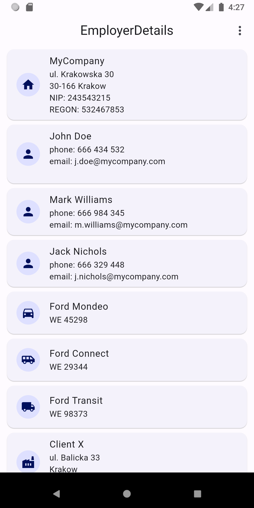
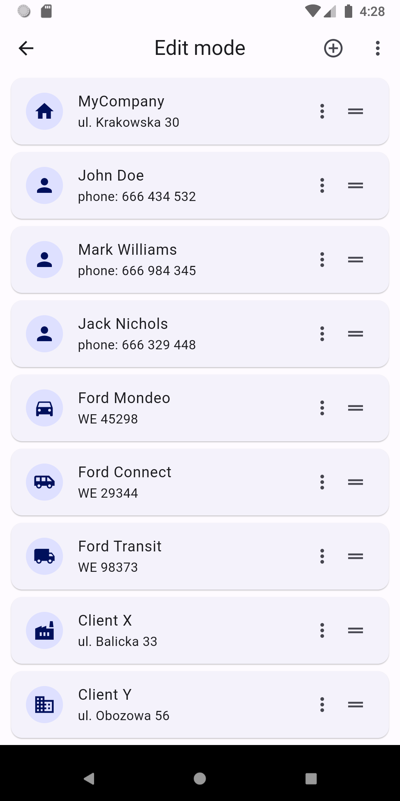
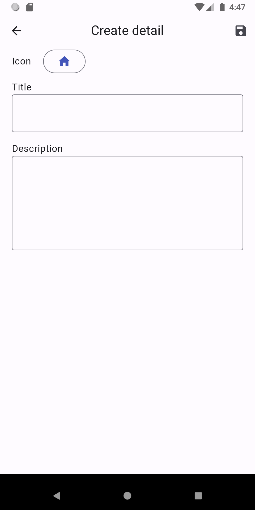
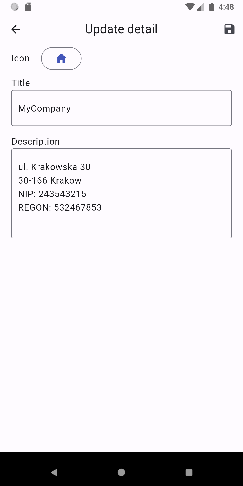

<a href="https://github.com/gzaber/employer_details/actions"></a>
<a href="https://codecov.io/gh/gzaber/employer_details"></a>
<a href="https://opensource.org/licenses/MIT"></a>

# employer_details

A mobile application for storing frequently used data of the company where you work.  
You can store for example: invoice data, car data, phone numbers, addresses etc.

## Table of contents

- [Screenshots](#screenshots)
- [Features](#features)
- [Packages used](#packages-used)
- [Setup](#setup)
- [Test](#test)
- [Run](#run)

## Screenshots

[](.screenshots/details_overview.png)
&nbsp;
[](.screenshots/edit_mode.png)
&nbsp;
[](.screenshots/settings.png)
&nbsp;
[](.screenshots/create_detail.png)
&nbsp;
[](.screenshots/update_detail.png)
&nbsp;
[](.screenshots/vid_settings.gif)
&nbsp;
[](.screenshots/vid1_edit_mode.gif)
&nbsp;
[](.screenshots/vid2_edit_mode.gif)
&nbsp;
[](.screenshots/vid3_edit_mode.gif)

## Features

- quick data preview
- data management
- reorder items
- import, export, share config
- share single item as text
- change theme / color scheme
- supported locales: en, pl

## Packages used

- cross_file
- file_picker
- flutter_bloc
- isar
- json_serializable
- share_plus
- shared_preferences

## Setup

Clone or download this repository.  
Use the following command to install all the dependencies:

```
$ flutter pub get
```

## Test

Run the tests using your IDE or using the following command:

```
$ flutter test --coverage
```

For local Flutter packages run the above command in the package root directory.  
For local Dart packages run the following commands in the package root directory:

```
$ dart pub global activate coverage
$ dart pub global run coverage:test_with_coverage
```

## Run

Run the application using your IDE or using the following command:

```
$ flutter run
```
